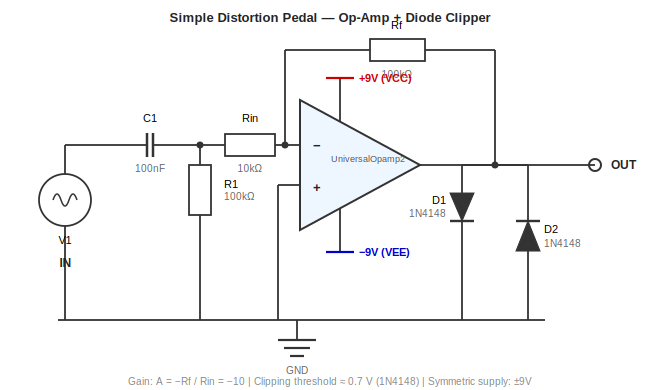

# Laborübung: Simulation eines Gitarren-Distortion-Pedals

**Lehrveranstaltung:** Schaltungssimulation mit LTspice IV
**Abgabeformat:** `.zip`-Archiv (siehe Abgabeliste)

---

## Ziel der Übung

Entwerfen und simulieren Sie ein einfaches analoges **Gitarren-Distortion-Pedal** in LTspice (aktuelle Version).
Sie importieren ein echtes Audiosignal, verarbeiten es in Ihrer Schaltung und exportieren das verzerrte Ausgangssignal als abspielbare `.wav`-Datei.

---

## Hintergrund / Funktionsprinzip

Gitarreneffekte werden durch analoge Signalverarbeitung erzeugt — Verstärkung, Filterung und nichtlineares Clipping. Ein Distortion-Pedal arbeitet in drei Schritten:

1. **Verstärkung** — das Gitarrensignal wird angehoben.
2. **Clipping** — das verstärkte Signal überschreitet die Versorgungsspannung; Dioden begrenzen die Amplitude.
3. **Verzerrtes Ausgangssignal** — das geclippte Signal enthält neue harmonische Oberwellen und erzeugt den typischen Verzerrungsklang.

In dieser Übung wird dieser Prozess in LTspice mit einer echten Audiodatei als Eingangssignal simuliert.

---

## Referenzschaltung — Das einfachste Distortion-Pedal

> **Hinweis:** Dieser Abschnitt dient als konzeptionelle Referenz zum Einstieg. Sie können diese Schaltung als Ausgangspunkt verwenden oder eine eigene Variante entwerfen.

Das klassische Lehrbeispiel ist ein **Operationsverstärker mit zwei antiparallelen Dioden** am Ausgang. Es ist die gängigste, stabilste und einsteigerfreundlichste Distortion-Schaltung.

**Warum diese Schaltung?**

- Sehr überschaubar — nur wenige Bauteile
- Konvergiert in LTspice zuverlässig
- Klar erkennbarer Verzerrungsmechanismus
- Direkte Entsprechung zu kommerziellen Pedalen (z. B. MXR Distortion+)

### Signalfluss

```
Eingang → Verstärker → Dioden-Clipping → Ausgang
```

Der Verstärker hebt das Signal an. Die Dioden begrenzen die Spannung — sobald das Signal die Flussspannung der Diode überschreitet, wird die Kurvenform abgeflacht. Dieses Clipping erzeugt harmonische Verzerrung.

### Schaltungstopologie



### Bauteilliste

| Bauteil | Wert | Funktion |
|---------|------|----------|
| OPV | UniversalOpamp2 | Verstärker |
| C1 | 100 nF | Eingangs-Koppelkondensator |
| R1 | 100 kΩ | Eingangs-Biaswiderstand |
| Rf | 100 kΩ | Rückkopplungswiderstand (bestimmt Verstärkung) |
| Rin | 10 kΩ | Eingangswiderstand (bestimmt Verstärkung) |
| D1 / D2 | 1N4148 | Antiparallele Clipping-Dioden |
| Versorgung | 9 V | Betriebsspannung des Pedals |

Die Verstärkung ergibt sich aus dem Verhältnis $A = -R_f / R_{in}$, also mit den obigen Werten: $A = -10$.

### Was Sie beobachten werden

- **Eingang:** saubere Sinuswelle (bzw. Audiosignal)
- **Ausgang:** abgeflachte Extremwerte — die geclippte Kurvenform klingt wie eine verzerrte Gitarre

---

## Aufgaben

### Aufgabe 1 — Audioverarbeitung in LTspice

Konfigurieren Sie eine Spannungsquelle in Ihrem Schaltplan so, dass sie eine `.wav`-Audiodatei als Eingangssignal einliest. Führen Sie eine Transientensimulation durch und exportieren Sie das Ausgangssignal als neue `.wav`-Datei. Sie können die bereitgestellte Beispielaufnahme oder eine eigene kurze Aufnahme (z. B. ein Gitarrentonbeispiel) verwenden.

> Die genauen Direktiven `wavefile=` und `.wave` finden Sie im Abschnitt **Hilfreiche Ressourcen** weiter unten.

**Ihre Aufgabe:** Bestimmen Sie die korrekte `.tran`-Stoppzeit selbstständig — es gibt dabei zwei typische Fehler, die Sie vermeiden sollen:

> ⚠️ **Zu kurz:** Wenn die Stoppzeit nur wenige Millisekunden beträgt, sehen Sie im Waveform-Viewer kaum etwas — das Signal ist nicht erkennbar, und es lässt sich nichts beurteilen.
>
> ⚠️ **Zu lang (komplette Datei):** Wenn Sie die gesamte Audiodatei simulieren (z. B. mehrere Sekunden), dauert die Simulation unnötig lange und der Waveform-Viewer ist überladen — einzelne Zyklen sind nicht mehr erkennbar.
>
> ✅ **Richtig:** Wählen Sie eine Stoppzeit, die **einige wenige vollständige Perioden** des Eingangssignals sichtbar macht. Überlegen Sie: Bei welcher Frequenz liegt das Audiosignal? Wie lang ist eine Periode bei dieser Frequenz?

**Dokumentationskriterien:**
- Screenshot des Spannungsquellen-Einstellungsdialogs mit dem Attribut `wavefile=`
- Screenshot der Transientensimulation mit `V(in)` und 3–10 klar erkennbaren Zyklen

---

### Aufgabe 2 — Entwurf der Distortion-Schaltung

Bauen Sie Ihre Distortion-Schaltung in LTspice auf. Die Schaltung muss enthalten:

- eine **Verstärkerstufe** (z. B. invertierender OPV mit `UniversalOpamp2`),
- eine **Clipping-Stufe** (zwei Dioden, z. B. 1N4148, antiparallel am Ausgang).

Simulieren Sie die Schaltung mit **zwei verschiedenen Verstärkungseinstellungen** und vergleichen Sie, wie sich das Ausmaß des Clippings verändert. Wählen Sie eine niedrige und eine hohe Verstärkung.

**Dokumentationskriterien:**
- Screenshot des vollständigen LTspice-Schaltplans
- Screenshot des Waveform-Viewers mit `V(out)` für **beide Verstärkungseinstellungen im selben Diagramm**, eindeutig beschriftet, sodass der Unterschied im Clipping erkennbar ist

---

### Aufgabe 3 — Verzerrtes Audioausgangssignal

Führen Sie eine Transientensimulation mit Ihrem Audioeingang durch und exportieren Sie den Ausgangsknoten als `.wav`-Datei. Das Ausgangssignal muss deutliches Hard-Clipping aufweisen.

> **Hinweis:** Diesmal muss die `.tran`-Stoppzeit lang genug sein, um die **gesamte Audiodatei** abzudecken — andernfalls wird die exportierte `.wav` abgeschnitten. Überlegen Sie, wie lang Ihre Eingangsaufnahme ist, und setzen Sie die Stoppzeit entsprechend.

**Dokumentationskriterien:**
- Screenshot des LTspice-Waveform-Viewers mit **sowohl** `V(in)` als auch `V(out)` im selben Diagramm, wobei das Clipping (abgeflachte Kurvenkämme) bei `V(out)` klar erkennbar ist
- Die exportierte Datei `output_distorted.wav` (anhören, um die hörbare Verzerrung zu bestätigen)
- Geben Sie die verwendete `.tran`-Stoppzeit an und bestätigen Sie, dass sie der Länge Ihrer Audiodatei entspricht

---

### Aufgabe 4 — Frequenzanalyse (Bode-Diagramm)

Führen Sie einen AC-Sweep über **10 Hz – 100 kHz** durch.

**Dokumentationskriterien:**
- Screenshot des Bode-Diagramms (Betrag in dB und Phase in Grad)
- Die **−3-dB-Grenzfrequenz** muss im Screenshot mit dem LTspice-Cursor markiert sein (setzen Sie den Cursor an die Stelle, an der die Verstärkung um 3 dB gegenüber dem Durchlassbereich abfällt, und nehmen Sie den Cursor-Messwert in den Screenshot auf)
- Geben Sie den gemessenen −3-dB-Frequenzwert in Ihrer schriftlichen Beschreibung an

---

### Aufgabe 5 — Abgabe

Geben Sie ein einzelnes `.zip`-Archiv mit allen in der Abgabeliste unten aufgeführten Dateien ab.

---

## Abgabeliste

| Aufgabe | Datei / Element | Beschreibung |
|---------|-----------------|---------------|
| **Aufgabe 1** | `screenshot_t1_source.png` | Spannungsquellen-Dialog mit dem Attribut `wavefile=` |
| **Aufgabe 1** | `screenshot_t1_waveform.png` | Transientenplot von `V(in)` mit einigen erkennbaren Zyklen |
| **Aufgabe 2** | `circuit.asc` | LTspice-Schaltplandatei |
| **Aufgabe 2** | `screenshot_t2_schematic.png` | Screenshot des vollständigen Schaltplans |
| **Aufgabe 2** | `screenshot_t2_gains.png` | Waveform-Vergleich von `V(out)` bei niedriger und hoher Verstärkung |
| **Aufgabe 3** | `screenshot_t3_clipping.png` | Waveform-Plot mit `V(in)` und `V(out)` mit sichtbarem Clipping |
| **Aufgabe 3** | `output_distorted.wav` | Exportierte verzerrte Audiodatei |
| **Aufgabe 4** | `screenshot_t4_bode.png` | Bode-Diagramm mit markierter −3-dB-Grenzfrequenz |
| **Alle** | `description.pdf` | Kurze schriftliche Beschreibung aller Aufgaben (max. 2 Seiten) |

Packen Sie alles in eine einzelne `.zip`-Datei mit dem Namen `nachname_vorname_distortion.zip`.

---

## Hilfreiche Ressourcen

### WAV-Import in LTspice

Um eine Audiodatei als Spannungsquelle in LTspice zu verwenden, wird das Attribut `wavefile` an einer Spannungsquelle gesetzt:

**Vorgehensweise:**
1. Platzieren Sie eine Spannungsquelle (`V`) im Schaltplan.
2. Rechtsklick auf die Spannungsquelle → *Advanced*.
3. Geben Sie im Feld *PWL* ein: `wavefile="input.wav"`
4. Legen Sie `input.wav` in denselben Ordner wie Ihre `.asc`-Schaltplandatei.

LTspice liest die `.wav`-Datei ein und verwendet sie als Eingangssignal im Zeitbereich.

---

### WAV-Export in LTspice

Um das Simulationsergebnis als abspielbare Audiodatei zu speichern, fügen Sie folgende SPICE-Direktive in Ihren Schaltplan ein:

```spice
.wave "output.wav" 16 44.1k V(out)
```

**Parametererklärung:**

| Parameter | Bedeutung | Beispiel |
|-----------|-----------|----------|
| `"output.wav"` | Ausgabedateiname | `"output_distorted.wav"` |
| `16` | Bittiefe (Audioauflösung) | 16 Bit = Standard-CD-Qualität |
| `44.1k` | Abtastrate in Hz | 44100 Hz = Standard-Audio |
| `V(out)` | Aufzuzeichnender Knoten | Der Ausgangsknoten Ihrer Schaltung |

**Direktive hinzufügen:**
1. Drücken Sie `S` in LTspice (oder *Edit → SPICE Directive*).
2. Geben Sie den `.wave`-Befehl ein.
3. Platzieren Sie ihn irgendwo auf dem Schaltplan.
4. Nach der Simulation erscheint `output.wav` im Ordner Ihres Schaltplans.

> **Tipp:** Stellen Sie sicher, dass die `.tran`-Stoppzeit lang genug ist, um den gesamten Audioclip zu erfassen (z. B. `.tran 3` für eine 3-Sekunden-Datei).

---

### Weitere Ressourcen

Die folgenden Ressourcen sind einsteigerfreundlich und direkt relevant für diese Übung:

1. **LTspice WAV-Datei Tutorial (YouTube)**
   Suche: *"LTspice wav file input output tutorial"*
   Viele kurze Video-Anleitungen behandeln genau die Direktiven `wavefile=` und `.wave`.

2. **Dioden-Clipping erklärt**
   [Analog Devices — Clipping and Clamping Circuits](https://www.analog.com/en/resources/technical-articles/clipping-and-clamping-circuits.html)
   Verständliche Erklärung, wie antiparallele Dioden ein Signal begrenzen, mit Wellenformbeispielen.

3. **Einfache (aber bereits fortgeschrittene) Distortion-Schaltpläne**
   - [ElectroSmash — Boss DS-1 Analysis](https://www.electrosmash.com/boss-ds1-analysis)
     Detailliertere Schaltung mit hervorgehobener Clipping-Stufe; nützlich, um Variationen des Grundprinzips zu verstehen.

4. **Offizielle LTspice-Dokumentation**
   [Analog Devices LTspice Help](https://www.analog.com/en/design-center/design-tools-and-calculators/ltspice-simulator.html)
   Verwenden Sie *Help → LTspice Help* in der Anwendung für die vollständige Syntaxdokumentation.

---

## Lernziele

Nach Abschluss dieser Übung sind Sie in der Lage:

- Echte Audiosignale (`.wav`) in LTspice-Simulationen zu importieren und zu exportieren.
- Eine nichtlineare analoge Schaltung (Dioden-Clipping) zu modellieren und ihr Zeitbereichsverhalten zu beobachten.
- Zu erklären, wie Verstärkung gefolgt von Clipping harmonische Verzerrung erzeugt.
- Ein Bode-Diagramm einer audiofrequenten Schaltung zu interpretieren.
- Einen strukturierten technischen Laborbericht zu erstellen und abzugeben.
